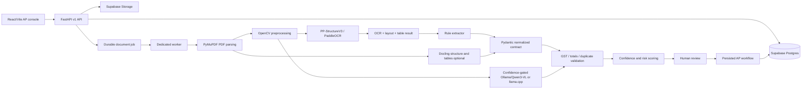

# Architecture

The API accepts validated PDF/image uploads, persists a pending durable job in Supabase
Postgres, and lets a separate worker process perform extraction. Source and processed
artifacts are stored in private Supabase Storage.

The domain schema is the serialization boundary shared by the API, JSON database column,
audit workflow, benchmark harness, and TypeScript client types. The `documents` row
remains the ingestion/evidence record; a one-to-one `invoices` projection carries
normalized AP state and links to vendors, POs, receipts, validations, risk, payments,
and workflow events. Optional adapters fail closed or fall back to deterministic local
implementations. The VLM interface supports local Ollama and an OpenAI-compatible
llama.cpp server; there is no paid cloud AI dependency.

The VLM is a fallback verifier, not the primary extractor. OCR/layout rules and the
first validation pass run before `_needs_verification` considers a local call. Missing
required fields, low composite confidence, or failed warning/error validations trigger
Ollama/Qwen3-VL (or the explicitly configured llama.cpp provider). The provider returns
the flat `LocalVLMResponse` JSON contract; Pydantic validates scalar types, nullable
unknowns, line items, taxes, and field boxes before mapping into `InvoiceExtraction`.
The merged extraction is validated again before AP projection. If the local server or
model is unavailable, the original deterministic result is retained and processing
continues.

Invoice detail pages also expose a grounded Ask Invoice AI path at
`POST /api/v1/invoices/{id}/qa`. It sends the persisted invoice projection, validation and
risk evidence, and bounded OCR token text to the configured Ollama model, without RAG or
external data. The model must return JSON containing an answer and evidence paths. If the
model is disabled, unavailable, or returns invalid output, deterministic AP answers remain
available for due dates, GST charges, totals, vendors, purchase orders, and risk signals.

Every extraction is converted into the nested `InvoiceDataStandard` contract before AP
projection. The extraction payload also retains per-field confidence, source, and
bounding boxes. The original uploaded file remains the source of truth, while each
processed page is stored as an authenticated PNG artifact with resize, orientation,
deskew, denoise, contrast, and threshold metadata. This lets review compare the source
document with the exact image that fed OCR without making a preprocessing decision
irreversible.

Deterministic rule families live under `backend/app/extraction/`: the shared
`RuleContext` searches label-near OCR lines across pages and unions token boxes into
field evidence; invoice number, date, GSTIN, PAN, supplier, buyer, amounts, payment,
and line-item modules then run before any optional local VLM. Digital PDFs use the
PyMuPDF table adapter first, with optional pdfplumber and Camelot fallbacks; scanned
documents use PP-StructureV3 table HTML, while Docling tables can enter through the
same normalized adapter shape. All of those providers map to the same line-item
contract with description, HSN/SAC, quantity, rate, GST rate, tax, and amount. GSTIN and PAN values are
normalised locally, with GSTIN syntax/state/checksum validation performed without a
government API. The OCR-token endpoint exposes both the legacy pixel fields and an
explicit `[x0, y0, x1, y1]` `bbox` for browser consumers.

Validation is split into `backend/app/validation/` families for invoice identity,
amounts, dates, GSTIN/PAN, and duplicate fingerprints. Financial validation explicitly computes
`subtotal - discount + tax + shipping` and reports the calculated total, invoice total,
difference, and tolerance. GST mode validation compares split CGST/SGST versus IGST
against available seller/buyer/place-of-supply state evidence and always labels the
result as an automated consistency check rather than a legal GST determination.

Rendered pages are scanned locally with OpenCV's QRCodeDetector. Common e-invoice JSON,
base64-wrapped JSON, URL-query, and key/value payloads are normalised into QR evidence
fields (invoice number/date, GSTIN, taxable amount, tax, total, IRN, and acknowledgement).
The projection stores field-level QR/OCR results as match, mismatch, or not comparable;
a mismatch is a review signal and does not replace the OCR/rule value. Invoice search
combines text fields with exact amount/date recognition and remains tenant-scoped.

The Supabase schema uses `users`, `vendors`, `invoices`, `invoice_items`, `invoice_taxes`,
`purchase_orders`, `purchase_order_items`, `goods_receipts`, `goods_receipt_items`,
`payments`, `invoice_validations`, `invoice_flags`, `ai_extractions`,
`human_corrections`, and append-only `audit_logs`. The existing `documents` and OCR evidence
tables remain the ingestion/source layer.

AP projection assigns a SHA-256 invoice fingerprint from supplier GSTIN, normalized invoice
number, invoice date, and grand total before inserting a new invoice record. Duplicate
validation returns the earlier invoice date, supplier, amount, fingerprint, and match type;
older rows without fingerprints use a vendor/invoice-number fallback. Vendor upsert searches
tenant-scoped GSTIN first and normalized name second, creating a master record when neither
matches and retaining vendor contact, banking, IFSC, and payment-term fields.

Invoice Risk & Anomaly Detection is deterministic and evidence-backed. It separately flags
exact duplicates, reused invoice numbers, unknown vendors, GSTIN drift from the vendor master,
changed bank details, unusual vendor-history amounts, large purchases, PO mismatches, date
anomalies, and failed validation checks. Each persisted risk flag carries a fixed point value
and JSON explanation; the invoice score is the capped sum of those contributions and is never
generated by the optional VLM. Conflicting GSTIN or bank evidence is retained on the invoice
for review without overwriting the trusted vendor-master value.

PO matching is two-way when no receipt exists and compares vendor, item identity, quantity,
rate, tax rate/total, currency, and total with a one-currency-unit rounding tolerance;
quantities are compared to four decimal places. When goods
receipts exist it becomes three-way: invoice quantities cannot exceed received quantities,
received quantities cannot exceed PO quantities, and each comparison is persisted in
`match_details` with a pass, partial, or mismatch message.

The review editor shows both processing stage and AP state. Human edits are revalidated on
the server, marked with `human_corrected` provenance, and appended to `human_corrections` using
the server's previous prediction and the corrected value. Invoice detail responses expose
those correction records, while `python -m eval.export_corrections` emits the legacy
`old_value`/`new_value` fields plus training-friendly `field`/`predicted`/`correct` aliases.

## Code layout and feature boundaries

The implementation now exposes the conventional architecture requested for the platform
without creating duplicate domain models or provider implementations:

| Requested boundary | Current implementation | Responsibility |
| --- | --- | --- |
| `app/models/` | `app/models/` → `app/domain/entities.py` | One SQLAlchemy mapping set for Supabase Postgres |
| `app/schemas/` | `app/schemas/` → `app/domain/schemas.py` | One Pydantic/API/extraction contract set |
| `app/database/` | `app/database/` → `app/core/database.py` | Async session, ORM base, and connectivity check |
| `services/ocr/` | `app/services/ocr/` → `app/adapters/ocr/` | Paddle/PP-StructureV3 primary and Tesseract fallback |
| `services/preprocessing/` | `app/services/preprocessing/` → `app/adapters/preprocessing/` | PyMuPDF, OpenCV, Pillow, and NumPy preprocessing |
| `services/extraction/` | `app/services/extraction/` + `app/extraction/` | Spatial rule extraction and orchestration |
| `services/validation/` | `app/services/validation/` + `app/validation/` | Pure checks plus the validation coordinator |
| `services/ai/` | `app/services/ai/` → `app/adapters/vlm/` | Ollama/Qwen local provider and llama.cpp fallback |
| `services/duplicate/`, `matching/`, `risk/` | `app/services/{duplicate,matching,risk}/` | Fingerprints, PO/three-way matching, deterministic risk points |

The API routers remain under `app/api/v1/`, and `app/services/ap_service.py` owns the
transactional AP projection/workflow so the worker and HTTP API share the same business
rules. The facade packages above are intentionally thin: there is one source of truth for
each ORM model, schema, OCR engine, and validation rule.

The Vite frontend follows the same feature boundary. `src/App.tsx` now owns only the
application shell and React Router configuration. Route entry points live under
`src/pages/` (`Dashboard`, `Upload`, `Invoices`, `InvoiceDetails`, `Review`, `Vendors`,
`PurchaseOrders`, `Payments`, and `Analytics`), while shared AP UI primitives live under
`src/components/ap/` (`InvoiceTable`, `InvoiceUploader`, `ValidationPanel`, `RiskBadge`,
`ConfidenceBadge`, `InvoiceViewer`, `ExtractionEditor`, `VendorCard`, and the dashboard primitives). Existing API calls remain
centralized in `src/lib/api-client.ts`, so page modules do not create separate HTTP clients.

## Security boundaries

- Upload content is magic-byte sniffed, size-limited, filename-sanitized, path-contained, and optionally scanned by ClamAV.
- API-key and HS256 bearer authentication are enabled only when credentials are configured, keeping local setup frictionless.
- Protected previews are downloaded through the authenticated API client as blob URLs.
- Secrets are environment variables; no provider key is stored in source.
