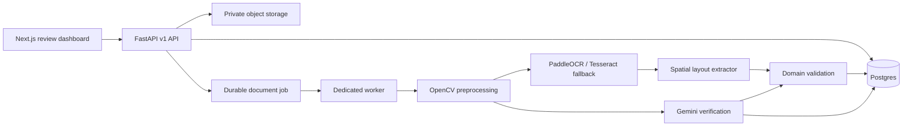

# Architecture

The API accepts validated PDF/image uploads, persists a pending durable job in Postgres, and lets a separate worker process perform extraction. Local SQLite and filesystem storage remain available only for laptop development.

The domain schema is the serialization boundary shared by the API, JSON database column, audit workflow, benchmark harness, and TypeScript client types. Optional adapters fail closed or fall back to deterministic local implementations.

## Security boundaries

- Upload content is magic-byte sniffed, size-limited, filename-sanitized, path-contained, and optionally scanned by ClamAV.
- API-key and HS256 bearer authentication are enabled only when credentials are configured, keeping local setup frictionless.
- Protected previews are downloaded through the authenticated API client as blob URLs.
- Secrets are environment variables; no provider key is stored in source.
